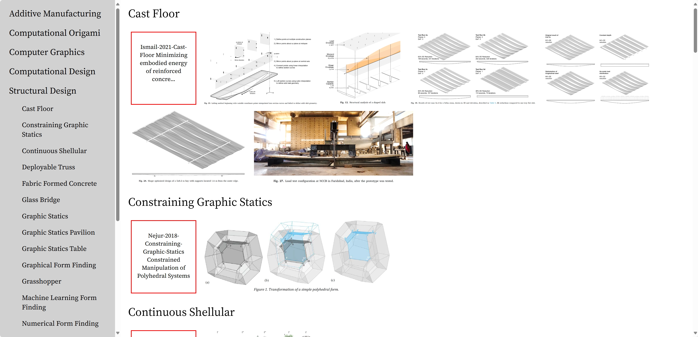

# BibGallery


BibGallery is a light, simple literature management library on Python that organizes BibTeX, PDF, and image files. It generates
HTML files to display the saved images for the researcher to browse.

You can benefit from BibGallery if

- You use [LaTeX](https://www.latex-project.org/) or [Typst](https://typst.app/) to write and thus save and cite your
  literature using BibTeX.
- You use screenshots to take notes of your literature.

I wrote BibGallery since my notes are essentially screenshots and I would like to review them efficiently.

## Preparations

BibGallery relies
on [pdf2bib](https://github.com/MicheleCotrufo/pdf2bib), [BibtexParser](https://bibtexparser.readthedocs.io/en/main/), [PyMuPDF](https://pymupdf.readthedocs.io/en/latest/index.html), [watchdog](https://github.com/gorakhargosh/watchdog), and [Pandas](https://pandas.pydata.org/).

BibGallery works best in [Visual Studio Code](https://code.visualstudio.com/) where you can easily navigate between
files.

Literatures have to be organized into **categories** and assigned **themes**. Each category uses one BibTeX file.

Short codes (also known as citation keys) in BibTeX files should be formulated as `Author-Year-Theme`, for
example, `Akbarzadeh-2020-Graphic-Statics-Table`. In case of short code collisions, add `-Number` to the end, for
example, `Akbarzadeh-2020-Graphic-Statics-Table` and `Akbarzadeh-2020-Graphic-Statics-Table-2`.

Your file structure should be:

```
root
├ Bib.py
├ Main.py
├ bib
│ ├ Category1.bib
│ └ Category2.bib
└ PDF
  ├ Category1
  │ ├ Author-Year-Theme Name of One Publication.pdf
  │ ├ Author-Year-Theme Name of One Publication.jpg
  │ ├ Author-Year-Theme Name of One Publication2.png
  │ ├ Author-Year-Theme Name of Another Publication.pdf
  │ ├ Author-Year-Theme Name of Another Publication.jpg
  │ └ ...
  └ Category2
    └ ...
```

## Initialization

### `Bib(self, inspect_categories, root_folder_path="", additional_categories=[], bibtex_folder="bib", bibtex_latex_folder="bib_latex", pdf_folder="PDF", html_folder="Gallery", pdf_collect_folder="to_collect", io_folder="")`

Set up by specifying the categories to inspect. The root folder and subfolders can be configured if necessary.

Parameters:

- inspect_categories : list of str. List of categories
- root_folder_path : str, default: ""
- additional_categories : list of str, default: []. List of categories that you only have bibtex files. E.g. bibtex from your collaborators or temporary bibtex files
- bibtex_folder : str, default: "bib"
- bibtex_latex_folder : str, default: "bib_latex"
- pdf_folder : str, default: "PDF"
- html_folder : str, default: "Gallery"
- pdf_collect_folder : str, default: "to_collect"
- io_folder : str, default: ""

Minimal working example:

```
from Bib import Bib
bib = Bib(inspect_categories=["Category1", "Category2"])
```

## Methods

### `Bib.check(self, update_bibtex=None, show_incomplete=True, check_books=False)`

Parse the BibTeX. If encoded for LaTeX, decode as Unicode plain text. Check if BibTeX/PDF/images are missing for any
entry. Only if all three are present, an entry will be considered complete. Incomplete entries will be listed in the
terminal. All results will be saved in `BibCheckResultAll.md`, `BibCheckResultNonBooks.md` and `BibCheckResultAll.csv`. Only complete entries
will be marked `t` in the results. Reviewing the results in Visual Studio Code allows you to click the links to go to
the PDF files easily.

Parameters:

- update_bibtex : str, default: None. Name of the additional bibtex file in `io_folder` for replacing existing bibtex
- show_incomplete : bool, default: True. Show incomplete entries in terminal
- check_books : bool, default: False. Show incomplete book entries in terminal

### `Bib.update_latex(self)`

Encode the BibTeX for LaTeX and save them as separate files in `self.bibtex_latex_folder`.

### `Bib.generate_html_files(self)`

Generate HTML galleries using the pictures in `self.html_folder`. Pictures are grouped by theme and titles link to the PDF files. Uses `BibCheckResultAll.csv` saved in `Bib.check(self)`.

### `Bib.gallery_watch(self)`

Update HTML galleries automatically each time a new screenshot is saved.

### `Bib.collect(self, enforce=False)`

Create new entries based on PDF files in `self.pdf_collect_folder`. Rename and move them into the main category folders and extract BibTeX based on the PDF
metadata. The PDF should be renamed as its theme.

The category of the PDF is specified by its parent folder. By default, the PDF to collect should be put as

```
root
└ to_collect
  └ Category
    └ Theme.pdf
```

and will be converted into

```
root
└ PDF
  └ Category
    └ Author-Year-Theme Name of Publication.pdf
```

If themes collide, simply leave additional spaces at the end.

If the short code collides with existing ones. An error will be raised. However, if  `enforce=True`, numbers will be added to the end, starting with "-2".

### `Bib.select_from_typst(self, input="input.typ", output="selected.bib")`

Inspect the entries cited in the Typst file and extract only the BibTeX used. Save both the plain text and LaTeX
version.

Parameters:

- input : str, default: "input.typ". Name of the typst file in `self.io_folder`
- output : str, default: "selected.bib". Name of the bibtex file for selected entries in `self.io_folder`

### `Bib.theme_replace(self, old, new)`

Rename a theme from old to new. Affects BibTeX, PDFs and images.

Parameters:

- old : str. Old theme
- new : str. New theme

### `Bib.short_code_replace(self, old, new)`

Rename a short code from old to new. Affects BibTeX, PDFs and images.

Parameters:

- old : str. Old short code
- new : str. New short code
